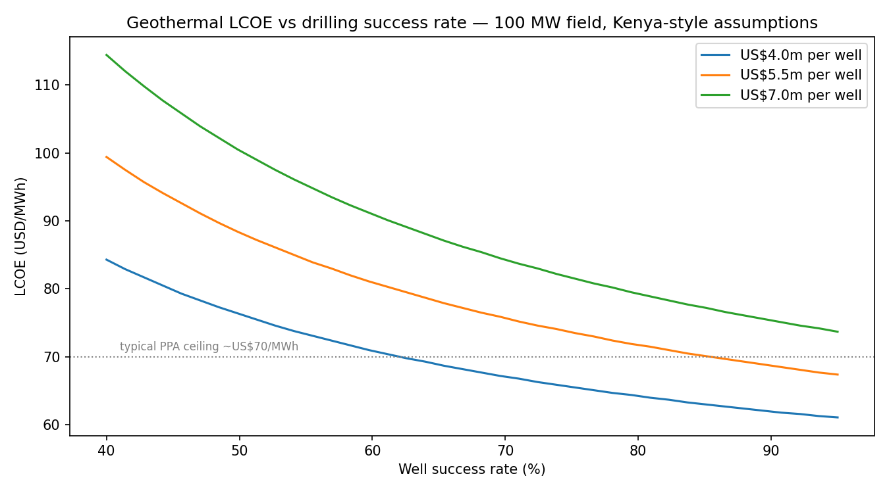
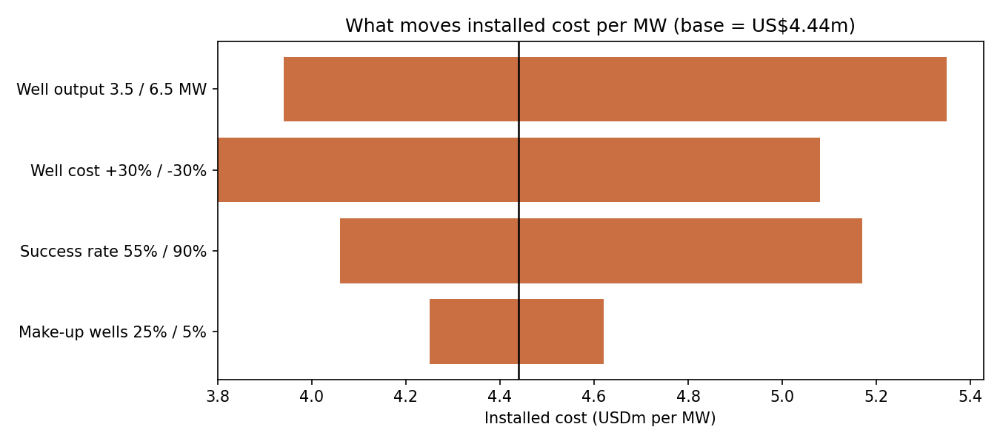

# Geothermal Drilling Cost — What Drives It, and How Much It Matters

**Central question:** what drives geothermal drilling cost, and how sensitive are
project economics to drilling outcomes?

Drilling is the risk that makes geothermal hard to finance. It is typically
**35–50% of total CAPEX**, it is spent *before* the resource is proven, and a dry
well is a sunk US$5–6m. This repo models a 100 MW field development case with
Kenya-style assumptions (Olkaria/Menengai well depths and productivities) and
quantifies how drilling outcomes move installed cost per MW and LCOE.

## Headline results (100 MW field)

| | Base (Kenya today) | Poor resource | +30% well cost | Learning case (Fervo-style) |
|---|---|---|---|---|
| Wells drilled (incl. dry + injection) | 39 | 75 | 39 | 34 |
| Drilling CAPEX (USDm) | 214 | 411 | 278 | 121 |
| Drilling share of CAPEX | 48% | 64% | 55% | 35% |
| Installed cost (USDm/MW) | 4.4 | 6.4 | 5.1 | 3.5 |
| **LCOE (USD/MWh)** | **74** | **102** | **83** | **61** |




## What the model shows

1. **Resource quality beats cost control.** Dropping from 74% to 55% well success
   *and* 5→3.5 MW/well pushes LCOE from $74 to $102/MWh — a project-killing move
   that no EPC discipline can claw back. This is why exploration drilling is the
   valley of death, and why instruments like GRMF (African Union geothermal risk
   mitigation) exist.
2. **Well productivity is the strongest single lever** on installed cost
   ($5.35m → $3.94m per MW across 3.5–6.5 MW/well). Steam-field management and
   targeting matter more than shaving day-rates.
3. **The learning case changes the game.** Fervo-style drilling improvements
   (−35% well cost, 85% success) bring LCOE to ~$61/MWh — competitive with
   dispatchable alternatives and inside typical PPA ceilings.
4. **Finance link:** because drilling risk is front-loaded and binary, lenders
   fund geothermal only after resource proof. The realistic capital structure is
   equity/grant-funded exploration, then debt against a proven steam field —
   the model's per-well economics show why.

## Model structure

Single script, no dependencies beyond pandas/numpy/matplotlib:

```bash
pip install -r requirements.txt
python drilling_economics.py
```

`drilling_economics.py` — field development model: wells needed (success rate,
injection ratio, make-up wells), drilling vs surface CAPEX, real-terms LCOE.
Outputs (scenario CSV, sensitivity CSV, two charts) land in `outputs/`.

`Geothermal.ipynb` — original exploratory notebook (industry cost trend vs
Fervo learning curve), kept for reference.

## Anchor sources

- IFC, *Success of Geothermal Wells: A Global Study* — development-well success ~74%
- IRENA *Renewable Power Generation Costs* — geothermal installed cost US$3–6m/MW
- GDC / KenGen public reporting — Kenyan well depths (~2,500–3,000 m) and costs (~US$5–6m)
- Fervo Energy published drilling results — learning-curve scenario

All anchor values are point estimates from public sources; the scenarios exist
precisely because each carries wide uncertainty.
